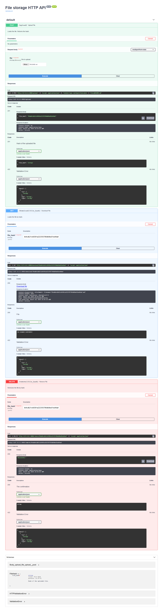

# Хранилище файлов с доступом по http
##### Демон, предоставляющий HTTP API для загрузки, скачивания и удаления файлов.

1. Запустить main.py
2. Открыть http://127.0.0.1:8000/docs

### Загрузка:
- получив файл от клиента, демон возвращает в отдельном поле http
response хэш загруженного файла
- демон сохраняет файл на диск в следующую структуру каталогов:
   store/ab/abcdef12345...
   где "abcdef12345..." - имя файла, совпадающее с его хэшем.
/ab/  - подкаталог, состоящий из первых двух символов хэша файла.
- Алгоритм хэширования по умолчанию = SHA-1.

### Скачивание:
Запрос на скачивание: клиент передаёт параметр - хэш файла. Демон ищет
файл в локальном хранилище и отдаёт его, если находит.

### Удаление:
Запрос на удаление: клиент передаёт параметр - хэш файла. Демон ищет
файл в локальном хранилище и удаляет его, если находит. 

# Скриншот:

